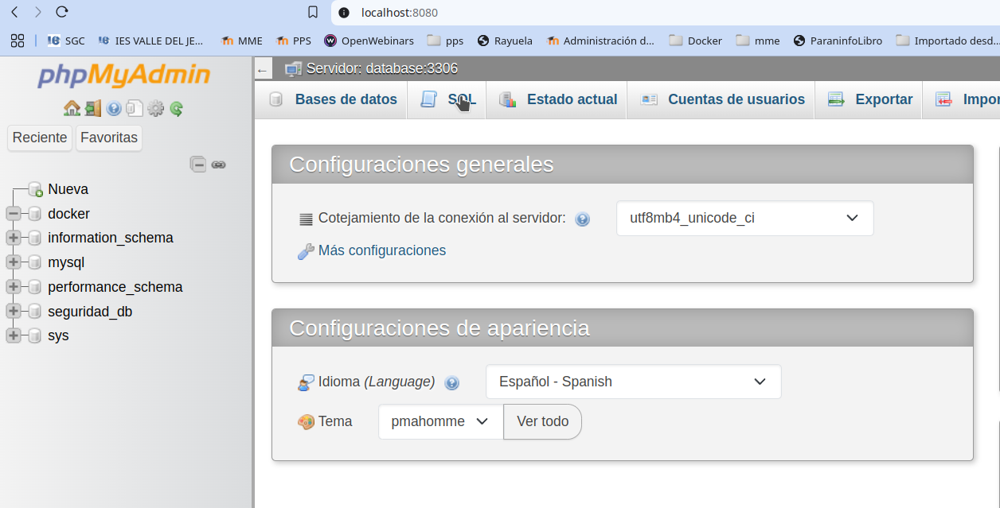
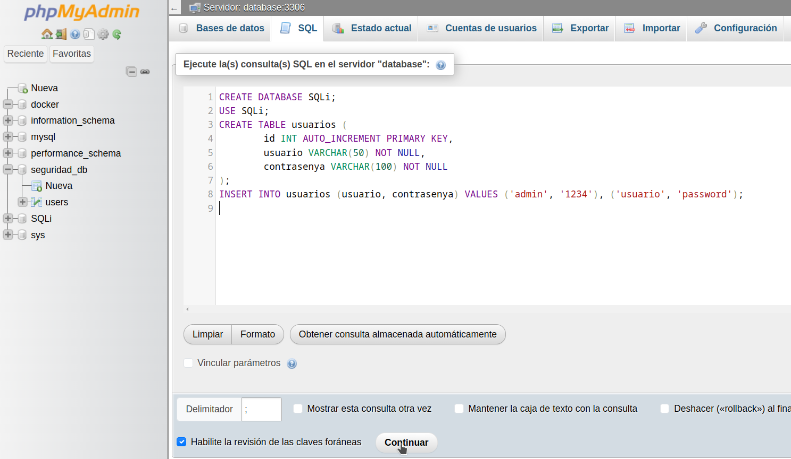

#PPS-Unidad3Actividad2-InyeccionSQL
Explotación y Mitigación de SQL Injection (SQLi)

Tenemos como objetivo:

> Recordar cómo se pueden hacer ataques de inyección de SQL
>
> Analizar el código de la aplicación que permite inyección SQL
>
> Implementar diferentes modificaciones del codigo para aplicar mitigaciones o soluciones.

# ¿Qué es SQL Injection (SQLi)?
---
**SQL Injection (SQLi)**  es un tipo de ataque en el que un atacante inserta código SQL malicioso en una consulta a la base
de datos, con el objetivo de manipular, robar o eliminar información sensible.
Este ataque ocurre cuando una aplicación no valida correctamente la entrada del usuario y ejecuta consultas SQL
dinámicas sin medidas de seguridad.

## ACTIVIDADES A REALIZAR
> Lee detenidamente la sección de Inyección SQL de la página de PortWigger <>
> Lee detenidamente la sección de Inyección SQL de la página de PortWigger <https://portswigger.net/web-security/sql-injection>
> Lee el siguiente [documento sobre Explotación y Mitigación de ataques de Inyección SQL](files/ExplotacionYMitigacionSQLInjection.pdf) de Raúl Fuentes. Nos va a seguir de guía para aprender a explotar y mitigar ataques de inyección SQL en nuestro entorno de pruebas.
> También y como marco de referencia, tienes [ la sección de correspondiente de inyección de SQL de la **Proyecto Web Security Testing Guide** (WSTG) del proyecto **OWASP**.](https://owasp.org/www-project-web-security-testing-guide/stable/4-Web_Application_Security_Testing/07-Input_Validation_Testing/05-Testing_for_SQL_Injection)

Vamos realizando operaciones:

### Iniciar entorno de pruebas
-Inicia el entorno de pruebas de nuestro servidor LAMP: `docker-compose up -v`

### Creación de base de datos
Para crear la Base de datos que vamos a utilizar para esta actividad tenemos varias opciones:

**OPCIÓN 1: Desde terminal**
Recordamos que nuestra base de datos se encuentra, en mi caso, en el contenedor _lamp-mysql18_, por lo que tenemos que conectarnos al servidor de MySQL que se encuentra en dicha máquina:
`docker exec -it  lamp-mysql8  /bin/bash`
Una vez dentro nos conectamos con la base de datos:
`mysql -u root -p`

y una vez conectado introducimos las consultas sql necesarias para crear la base de datos, tabla e introducir los datos de los usuarios:
~~~
CREATE DATABASE SQLi;
USE SQLi;
CREATE TABLE usuarios (
	id INT AUTO_INCREMENT PRIMARY KEY,
	usuario VARCHAR(50) NOT NULL,
	contrasenya VARCHAR(100) NOT NULL
);
INSERT INTO usuarios (usuario, contrasenya) VALUES ('admin', '1234'), ('usuario', 'password');
~~~
Vemos como se ha creado correctamente, tanto Base de Datos, como tabla y usuarios:

**OPCIÓN 2: a través de PHPmyAdmin**
- Accedemos via web al servicio de phpmyadmin que tenemos instalado: <http://localhost:8080>

- Al pulsar la opción de sql, podemos ejecutar las sentencias de sql que necesitemos.

- Por lo tanto, tan sólo tenemos que introducir las sentencias SQL del apartado anterior.

**OPCIÓN 3: completamente de manera gráfica**
- Accedemos via web al servicio de phpmyadmin que tenemos instalado: <http://localhost:8080>

<<<<<<<<

- Creamos una base de datos nueva, pulsando el botón de _Nueva_

- Vamos a llamar a la tabla SQLi

- Una vez creada, inmediatamente nos sugiere que creemos una tabla nueva. La tabla que necesitamos se llamará **Usuarios* y debe de tener 3 columnas:**id, nombre y contrasenya**, cada una con su tipo de valor correspondiente.

- Una vez creada podemos introducir los valores de los usuarios que queramos pulsando en **Insertar**

- y introducimos los valores que queremos. 

 
### Crear página web en Apache
Vamos a crear una web con la que podamos explotar la vulnerabilidad de Inyección SQL. Esta aplicación o código debe de estar alojado en nuestro servidor web Apache.
Recordamos que en nuestro docker-compose hemos creado un volumen bind-mount para poder utilizar los archivos de nuestro sistema anfitrión. En concreto, tenemos una carpeta www que se monta en la carpeta **/var/www/html** del servidor web. Por lo tanto es muy sencillo colocar en el servidor, los archivos y carpetas que queramos.
- Me situo en la carpeta _www_ y creo una carpeta con nombre SQLi  para esta actividad.

- Creo dentro de esa carpeta un archivo PHP con nombre **login1.php**, con el siguiente contenido:

¡¡¡OJO¡¡¡ que en la 2ª linea hay que cambiar PasswordBBDD por la contraseña de root de tu BBDD (recuerda que la tienes en la configuración de variables de entorno, el archivo .env).
~~~
<?php
$conn = new mysqli("database", "root", "josemi", "SQLi");
        if ($_SERVER["REQUEST_METHOD"] == "POST") {
                $username = $_POST["username"];
                $password = $_POST["password"];
                $query = "SELECT * FROM usuarios WHERE usuario = '$username' AND contrasenya = '$password'";
                echo "Consulta ejecutada: " . $query . " ";
                $result = $conn->query($query);
                if ($result) {
                        if ($result->num_rows > 0) {
                                echo "Inicio de sesión exitoso ";
                                // Modificación: Mostrar datos extraídos de la consulta
                                while ($row = $result->fetch_assoc()) {
                                        echo "ID: " . $row['id'] . " - Usuario: " . $row['usuario'] . " -Contraseña: " . $row['contrasenya'] . " ";
                                }
                } else {
                        echo "Usuario o contraseña incorrectos";
                }
        } else {
                echo "Error en la consulta: " . $conn->error;
        }
}
?>
<form method="post">
        <input type="text" name="username" placeholder="Usuario">
        <input type="password" name="password" placeholder="Contraseña">
        <button type="submit">Iniciar Sesión</button>
</form>

~~~

Ya tendremos preparado nuestro servidor web para poder ver las vulnerabilidades de Inyección SQL. Accedemos desde `http://localhost/SQLi/login1.php`

## Mitigación de vulnerabiliad

Para ir incorporando soluciones, sin eliminar las anteriores versiones, vamos a crear a partir del archivo anterior, otro en el que modificar cosas para ir aproximádonos a la mejor solución: `cp login1.php login2.php` 

### Primera mitigación, escapar los caracteres especiales.

Como vemos, podemos incluir consultas dentro de los campos, al utilizar caracteres especiales como las comillas.
Por lo tanto la primera aproximación sería escapar esos caracteres especiales de los valores de la consulta.
La función **addslashes()** nos permite hacerlo.
Por lo tanto, modificamos el archivo anterior, introduciendo las lineas de escape de caracteres especiales tanto del campo de usuario como de la contraseña.

### 

---	
## ENTREGA

>__Realiza las operaciones indicadas__

>__Crea un repositorio  con nombre PPS-Unidad3Actividad3-Tu-Nombre donde documentes la realización de ellos.__

> No te olvides de documentarlo convenientemente con explicaciones, capturas de pantalla, etc.

>__Sube a la plataforma, tanto el repositorio comprimido como la dirección https a tu repositorio de Github.__
